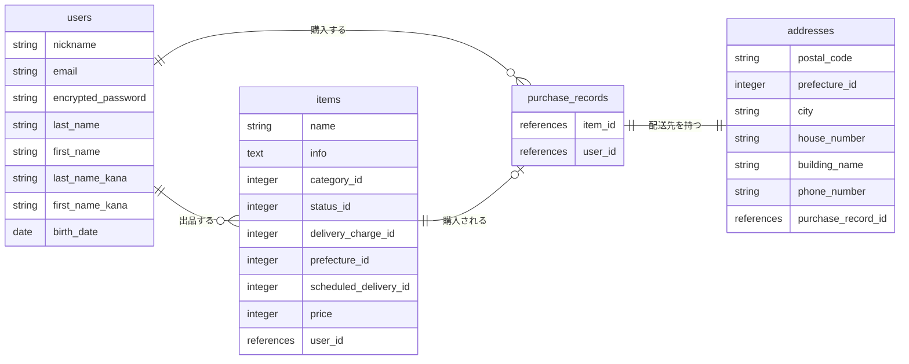

# furima-47781

フリマアプリ（[https://furima2020.herokuapp.com/](https://furima2020.herokuapp.com/) 相当）を再現するためのデータベース設計。

## テーブル設計

### users テーブル（ユーザー管理機能）

deviseを利用する。

| Column             | Type   | Options                  |
| ------------------ | ------ | ------------------------ |
| nickname            | string | null: false               |
| email               | string | null: false, unique: true |
| encrypted_password  | string | null: false               |
| last_name           | string | null: false               |
| first_name          | string | null: false               |
| last_name_kana      | string | null: false               |
| first_name_kana     | string | null: false               |
| birth_date          | date   | null: false               |

#### Association

- has_many :items
- has_many :purchase_records

補足：`last_name`・`first_name` は全角（漢字・ひらがな・カタカナ）、`last_name_kana`・`first_name_kana` は全角カタカナのみを許可するバリデーションを行う。パスワードは半角英数字混合、6文字以上（devise標準のバリデーションに加えて英数字混合の条件を追加）。

---

### items テーブル（商品出品機能）

| Column                | Type       | Options                        |
| --------------------- | ---------- | ------------------------------- |
| name                  | string     | null: false                      |
| info                  | text       | null: false                      |
| category_id           | integer    | null: false                      |
| status_id             | integer    | null: false                      |
| delivery_charge_id    | integer    | null: false                      |
| prefecture_id         | integer    | null: false                      |
| scheduled_delivery_id | integer    | null: false                      |
| price                 | integer    | null: false                      |
| user_id               | references | null: false, foreign_key: true   |

画像は Active Storage（`has_one_attached :image`）で保持するため、items テーブル自体にはカラムを持たない。

#### Association

- belongs_to :user
- has_one :purchase_record
- has_one_attached :image

---

### purchase_records テーブル（商品購入機能・購入履歴）

| Column  | Type       | Options                       |
| ------- | ---------- | ------------------------------ |
| item_id | references | null: false, foreign_key: true |
| user_id | references | null: false, foreign_key: true |

#### Association

- belongs_to :item
- belongs_to :user（購入者）
- has_one :address

---

### addresses テーブル（商品購入機能・配送先情報）

| Column             | Type       | Options                        |
| ------------------ | ---------- | -------------------------------- |
| postal_code         | string     | null: false                      |
| prefecture_id       | integer    | null: false                      |
| city                | string     | null: false                      |
| house_number        | string     | null: false                      |
| building_name       | string     |                                   |
| phone_number        | string     | null: false                      |
| purchase_record_id  | references | null: false, foreign_key: true   |

購入時にクレジットカード決済（payjp等）と同時に入力される配送先情報。`building_name` のみ任意項目。

#### Association

- belongs_to :purchase_record

---

### カテゴリー・商品状態などの選択肢（ActiveHashで管理し、テーブルは作成しない）

以下はDBに保存する情報ではなく、フォームのプルダウンなど固定の選択肢として扱うため ActiveHash で実装する。

- Category（カテゴリー）: items.category_id
- Status（商品の状態）: items.status_id
- ShippingFeeStatus（配送料の負担）: items.delivery_charge_id
- Prefecture（発送元の地域 / 配送先の都道府県）: items.prefecture_id, addresses.prefecture_id
- ScheduledDelivery（発送までの日数）: items.scheduled_delivery_id

## ER図

